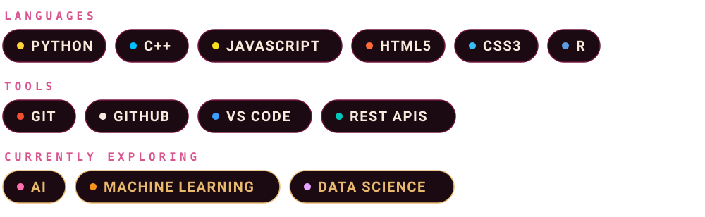

<div align="center">




</div>

---

# 🖤 01 — ABOUT ME

### Hi, I'm **Sakshi Rathod** ✦

I'm a **3rd-year B.Sc. Computer Science student** who enjoys building things that combine **technology, creativity and meaningful user experiences**.

I love exploring the space between **beautiful interfaces and intelligent systems** — from modern web applications to AI/ML projects.

> **I don't just want to learn technology.  
> I want to build with it.**

### ✦ What I'm focused on

- 💻 Web Development
- 🤖 Artificial Intelligence
- 🧠 Machine Learning
- 📊 Data Science
- 🎨 UI/UX & Interactive Experiences
- 🚀 Building real-world projects

---

# 🍒 02 — TECH STACK



---

# 💗 03 — SELECTED WORK

<table>
<tr>

<td width="50%" valign="top">

<h2>🤖 SRLearn AI</h2>

<b>Adaptive AI Learning Platform</b>

<br><br>

A personalized learning platform concept designed to understand a student's level, identify learning gaps and create a more adaptive learning experience.

<br><br>

<code>AI</code> <code>EDUCATION</code> <code>WEB</code>

</td>

<td width="50%" valign="top">

<h2>👁️ VisionVerify</h2>

<b>AI-Powered Verification</b>

<br><br>

A computer-vision focused project exploring intelligent image verification and digital authenticity analysis.

<br><br>

<code>AI</code> <code>COMPUTER VISION</code> <code>WEB</code>

</td>

</tr>

<tr>

<td width="50%" valign="top">

<h2>🌙 Moon Light Cafe</h2>

<b>Modern Café Web Experience</b>

<br><br>

A responsive café website focused on visual design, usability, interactive elements and a polished user experience.

<br><br>

<code>HTML</code> <code>CSS</code> <code>JAVASCRIPT</code>

</td>

<td width="50%" valign="top">

<h2>🌡️ Temperature Converter</h2>

<b>Interactive Web Application</b>

<br><br>

A responsive JavaScript application for converting temperatures between different units.

<br><br>

<code>HTML</code> <code>CSS</code> <code>JAVASCRIPT</code>

</td>

</tr>
</table>

---

# ✦ 04 — MY DEVELOPMENT JOURNEY

<div align="center">

```text
          HTML + CSS
              ↓
         JavaScript
              ↓
           Python
              ↓
      Web Development
              ↓
        Data Science
              ↓
 Artificial Intelligence
              ↓
    Machine Learning
              ↓
     Real World Projects
              ↓
              ✦
```

</div>
